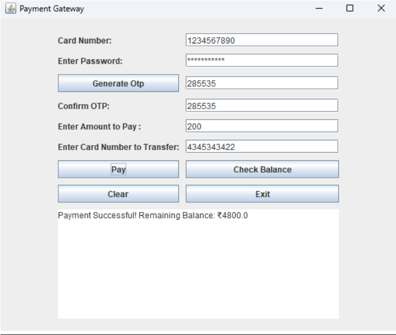
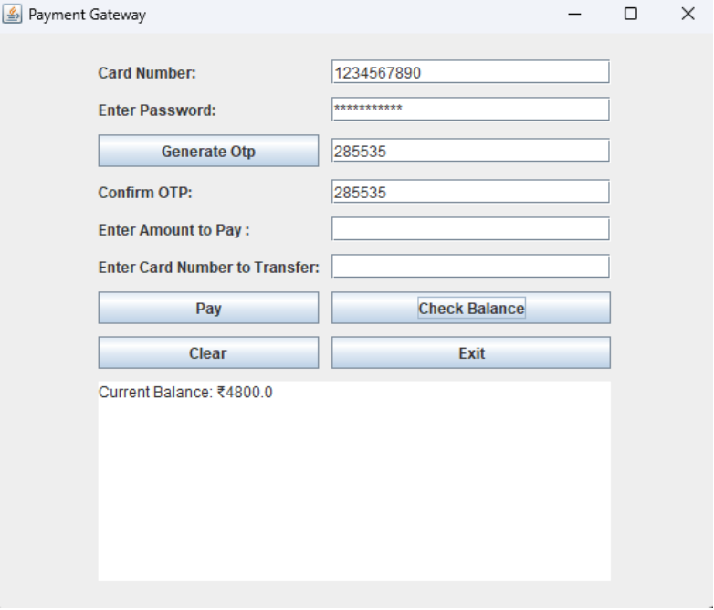
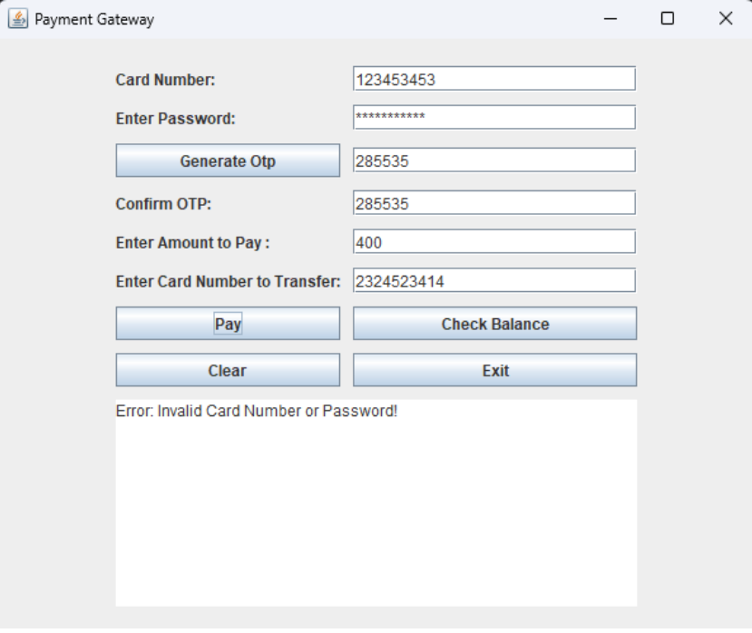
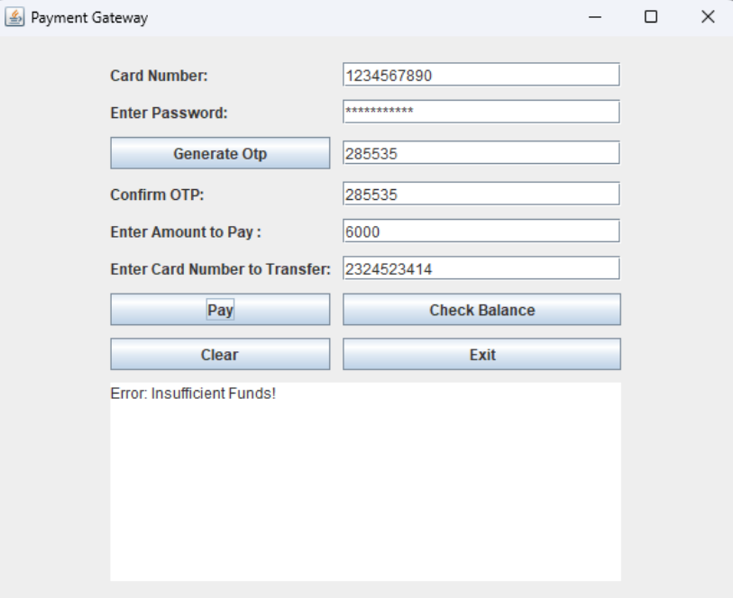
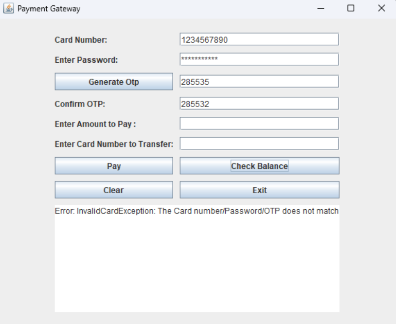
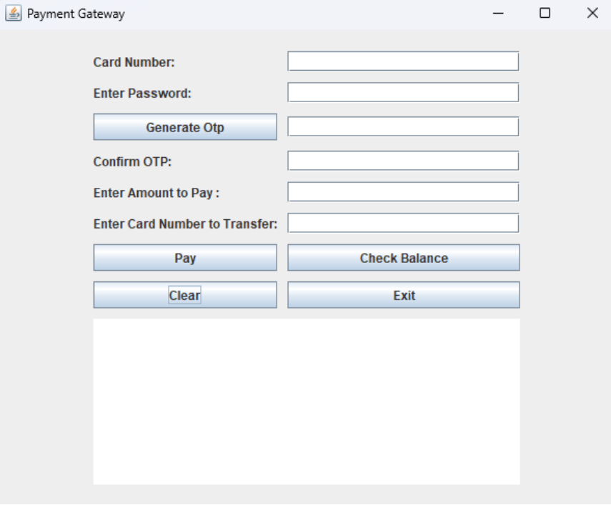

# 💳 Online Payment Gateway Simulation

This is a Java Swing-based desktop application that simulates a basic online payment gateway system. It allows users to enter card details, generate and validate OTP, check balance, and make payments. This project is designed to demonstrate key Java concepts including GUI programming, event handling, custom exceptions, and basic validation logic.

## 🛠️ Features

- Card number and password verification
- OTP generation and validation
- Payment processing with balance deduction
- Balance check functionality
- Clear and Exit buttons for UI control
- Custom exceptions:
    - InvalidCardException
    - InsufficientFundsException
    - NetworkTimeoutException

## 🧑‍💻 Technologies Used

- Java (JDK 17+)
- Java Swing (AWT + Swing)
- Object-Oriented Programming
- Exception Handling

## ▶️ How to Run

1. Clone this repository or download the `.java` file.

2. Compile the code using:
   ```bash
   javac Micro_Project.java
   ```

3. Run the application:
   ```bash
   java Micro_Project
   ```

> Make sure Java is properly installed and configured in your system path.

## 🧠 Learning Outcomes

- Develop Java programs using classes and objects.
- Implement code reusability using inheritance.
- Apply multithreading and custom exception handling.
- Build GUI-based applications using Swing.
- Understand event-driven programming.
- Simulate real-world payment systems in a controlled environment.

## ℹ️ Project Details

This project includes a payment form where users can:

- Enter a predefined card number and password
- Generate a random 6-digit OTP
- Validate the OTP before making a transaction
- Check their current balance
- Clear form inputs or exit the app gracefully

If invalid inputs are provided, appropriate custom exceptions are thrown and displayed in the status area.

---

## 📚 Microproject Details

This is a certified microproject submitted as a part of the curriculum for **Java Programming (314317)** under the **Maharashtra State Board of Technical Education (MSBTE)** for the **4th Semester - K Scheme**, Diploma in Computer Technology.

---

## 📸 Output Screenshots


1. **Payment Successful**  
   

2. **Current Balance**  
   

3. **Invalid OTP**  
   

4. **Insufficient Funds!**  
   

5. **Invalid Card Number**  
   

6. **Use of Clear Button**  
   

---
## 🧑‍🤝‍🧑 Team Members

- 👨‍🎓 Pavan Vishnu Damji 
- 👨‍🎓 Venkatesh Sudhir Soma 
- 👨‍🎓 Prajwal Yallappa Sanade 

---
## 🏫 Submitted To

**S.E.S. Polytechnic, Solapur**  
Department of Computer Engineering  
Academic Year: 2024–2025  

---

## 📬 Contact Me

- 🔗 GitHub: [github.com/PavanDamji4](https://github.com/PavanDamji4)
- 💼 LinkedIn: [linkedin.com/in/pavan-damji-984608319](https://www.linkedin.com/in/pavan-damji-984608319/)